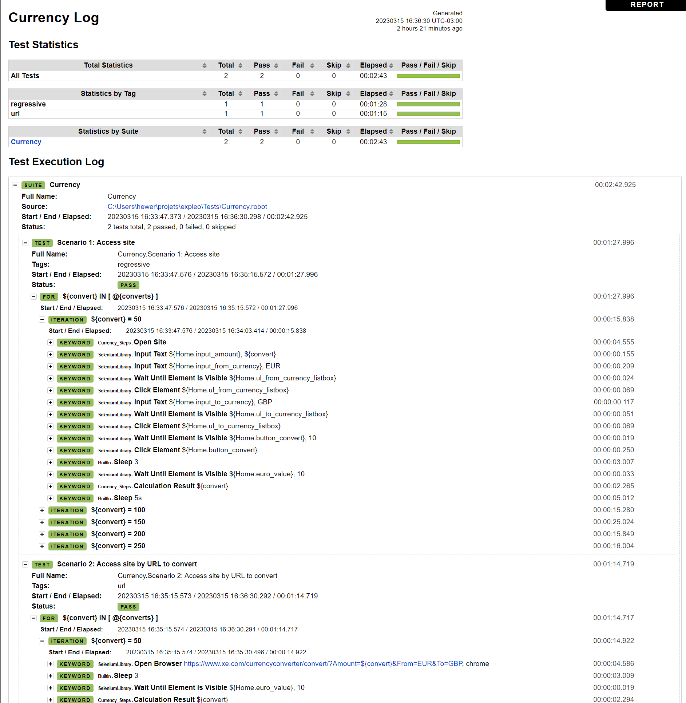

## Requirements

Pyhon 3.10

Robot Framework

Seleniumlibrary

## ChromeDriver

Unzip chromedriver_win32.zip to Scripts folder in Python directory

Example in Windows: ``C:\Users\<Your_User>\AppData\Local\Programs\Python\Python311\Scripts``

## Install requirements
``pip install -r requirements.txt``

## Execute project
Go to Tests folder in terminal

``cd Tests``

Run test

``robot -d ../results Currency.robot``

Run just by Scenario 1

``robot -d results Currency.robot -t "Scenario 1: Access site"``

Run by Tags
``robot -d results Currency.robot -i regressive``

Run by Folder
``robot -d results Currency.robot Tests``

## Folder Elements 
Contains the Objects Pages 

## Folder Resoruce 
Contains the Settings file

## Steps folder 
Contains the Keywords to use in Tests

## Evidence of success

